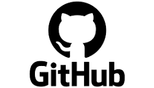

     

<h3 align="center">
  Desafio Backend do BTG Pactual
</h3>

  
  
  

# Desafio
- Confira o enunciado completo, [clicando aqui](./problem.md).

# Como interagir com o banco de dados?
- Utilizamos o [MongoDB Compass](https://www.mongodb.com/products/tools/compass)  

    

# Como interagir com a API?
- Utilizamos o [Postman](https://https://www.postman.com/downloads/) 

    

# :🚀: Tecnologias utilizadas

- [Java 21](https://www.oracle.com/br/java/technologies/downloads/#java21) 

- [Spring Boot](https://spring.io/projects/spring-boot) 

 - [Spring Data MongoDB](https://spring.io/projects/spring-data-mongodb) 

- [RabbitMQ](https://www.rabbitmq.com/) 

- [Docker](https://www.docker.com/) 

# 👁‍🗨 Saiba mais sobre o Projeto

- [Baixe o projeto e teste você mesmo na prática.](https://github.com/rossattijuniordeveloper/desafio_btg) 

- [Conheça mais sobre o meu trabalho 😀](https://github.com/rossattijuniordeveloper)

Developed by Rossatti Junior coderseniorjava@gmail.com